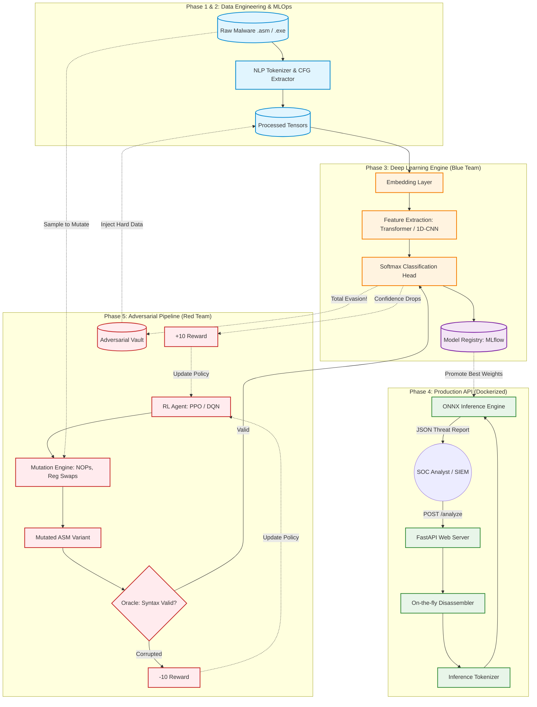

Here is the complete, consolidated Technical Specification Document in Markdown format. It incorporates Phases 1 through 4, alongside the new Phase 5 (Adversarial ML Evasion Pipeline) and features a unified architecture diagram showing how the Red Team and Blue Team interact.

You can copy this entire block and save it directly as `SPEC.md` or `ARCHITECTURE.md` in the root of your repository.

```markdown
# Technical Specification: Project Wintermute
**Version:** 3.0 (Enterprise Refactor, MLOps, & Adversarial Hardening)  
**Domain:** Deep Learning, NLP, Static Malware Analysis, Adversarial ML  
**Objective:** Transition Wintermute from a sequential scripting prototype into a modular, production-ready MLOps classification engine, fortified by an automated Adversarial Reinforcement Learning (RL) pipeline to defend against zero-day obfuscation techniques.

---

## 1. Executive Summary
Project Wintermute is an AI-powered static malware analysis framework. By treating disassembled executables (`.asm`) as a Natural Language Processing (NLP) problem, Wintermute maps execution flow to integer tokens, passing them through a Deep Learning sequence model to classify malware families (e.g., *AgentTesla*, *Trickbot*). 

To ensure resilience against real-world evasion techniques (polymorphism, crypters, dead-code injection), Wintermute incorporates an **Adversarial Machine Learning (AdvML)** feedback loop. An RL "Attacker" agent automatically generates evasive malware variants to test the model, discover blind spots, and iteratively retrain the "Defender" network.

---

## 2. System Architecture Diagram

The following diagram illustrates the complete end-to-end pipeline, including data ingestion, deep learning classification, production deployment, and the Adversarial Red-Team loop.



---

## 3. Phase 1: Architectural Refactoring (Software Engineering)

**Goal:** Eliminate tightly coupled, sequentially numbered scripts (`01_`, `02_`) in favor of a modular, object-oriented Python package.

### 3.1 Target Directory Structure

```text
wintermute/
├── configs/                    # Centralized configurations (YAML)
│   ├── data_config.yaml        # Vocab sizes, sequence lengths, paths
│   └── model_config.yaml       # Learning rate, batch size, layers
├── data/                       # Ignored by Git, managed by DVC
│   ├── raw/                    # Raw Bazaar and MS-Malware files
│   ├── processed/              # Tokenized tensors, vocab.json
│   └── synthetic/              
│       └── adversarial_vault/  # Evasive variants generated by Red Team RL
├── src/wintermute/             # Main Python Package
│   ├── __init__.py
│   ├── data/                   # Downloader, Tokenizer, and Augmentation logic
│   ├── models/                 # Sequence.py, Transformer.py definitions
│   ├── engine/                 # Trainer.py, Metrics calculations
│   ├── adversarial/            # NEW: Red Team Pipeline (Phase 5)
│   │   ├── environment.py      # OpenAI Gym wrapper for ASM sequence
│   │   ├── actions.py          # NOPs, Reg Swaps, Dead Code logic
│   │   ├── agent.py            # Stable-Baselines3 RL Agent
│   │   └── oracle.py           # AST/CFG parsing to verify assembly validity
│   └── cli.py                  # Centralized command-line interface
├── api/                        # FastAPI REST wrappers
├── tests/                      # Pytest unit and integration tests
├── Dockerfile                  # Containerization for deployment
├── pyproject.toml              # Modern dependency management (uv/Poetry)
└── dvc.yaml                    # Data pipeline orchestration (DAG)

```

---

## 4. Phase 2: MLOps Implementation

**Goal:** Introduce tracking and reproducibility to handle massive malware datasets and prevent concept drift.

* **Data Version Control (DVC):** Track massive `.asm` files using DVC, storing data in remote blob storage (S3/NAS) while keeping lightweight `.dvc` pointer files in Git.
* **Pipeline Orchestration (DAGs):** Use `dvc.yaml` to define the data flow (`Download -> Tokenize -> Adversarial Loop -> Train`). `dvc repro` will automatically cache unchanged steps and run modified ones.
* **Experiment Tracking:** Integrate **Weights & Biases (W&B)** or **MLflow** into the trainer to log loss curves, validation accuracy, F1-scores, and hyperparameters.

---

## 5. Phase 3: AI & Feature Engineering Enhancements

**Goal:** Harden the neural network against basic obfuscation and improve context retention over large file sizes.

* **Transformer Architecture (MalBERT):** Replace LSTMs/CNNs with a Self-Attention mechanism, allowing Wintermute to mathematically connect malicious intent across thousands of lines of assembly, ignoring injected junk code.
* **Control Flow Graphs (CFG):** Utilize tools like `radare2` to extract the CFG and pass it through a Graph Neural Network (GNN) to analyze logical execution flow rather than raw top-to-bottom text.
* **Late Fusion (Multi-Modal):** Extract Portable Executable (PE) metadata (e.g., Imported DLLs, Entropy) via the `pefile` library. Pass this through a Dense network and concatenate it with the NLP tensor output prior to the final classification layer.

---

## 6. Phase 4: Production Inference Pipeline (Deployment)

**Goal:** Decouple Wintermute from manual Python scripts and deploy it as an accessible cybersecurity tool for SOC Analysts.

* **Automated Disassembly Engine:** Integrate **Capstone** or **LIEF** directly into the inference pipeline. Users can input a raw `.exe`, and Wintermute will automatically unpack and disassemble it in memory.
* **REST API Server:** Build a highly scalable, asynchronous **FastAPI** application (`POST /api/v1/analyze`) returning JSON threat payloads (containing confidence scores, predicted families, and execution times).
* **Containerization:** Package the FastAPI server, OS-level disassembler dependencies, and ONNX-optimized model weights into a lightweight **Docker** container for instant deployment in air-gapped environments.

---

## 7. Phase 5: Adversarial Evasion & Robustness Pipeline

**Goal:** Automatically generate evasive, heavily obfuscated variants of known malware to test the classifier, discover blind spots, and iteratively retrain it.

### 7.1 Functionality-Preserving Perturbations (FPP)

To mutate assembly without breaking the compiled binary, the Attacker AI is restricted to "Safe Actions":

* **NOP Sledding:** Injecting `nop` instructions to disrupt spatial patterns.
* **Instruction Substitution:** Swapping exact functional equivalents (e.g., `xor eax, eax` for `sub eax, eax`).
* **Dead Code Insertion:** Pushing/Popping registers (`push ebx; pop ebx`) to change the NLP token sequence without altering CPU state.
* **Register Reassignment:** Using liveness analysis to safely swap unused CPU registers within a specific block.

### 7.2 The Reinforcement Learning (RL) Loop

Because Assembly is discrete, standard GANs cannot be used to generate functioning code safely. We implement a Reinforcement Learning architecture (e.g., PPO via Ray RLlib or Stable-Baselines3).

1. **The Attacker (RL Agent):** Treats the malware `.asm` sequence as an OpenAI Gym Environment. It selects target lines and applies FPP actions.
2. **The Oracle (Verifier):** A syntax checker that verifies the mutated ASM. If the CFG or stack frame is corrupted, the Oracle halts the attempt and applies a massive negative reward (`-10.0`).
3. **The Defender (Wintermute):** If the code is valid, it is passed to Wintermute.
* If Wintermute detects the malware easily -> `Reward: -1.0`
* If Wintermute's confidence drops significantly -> `Reward: +10.0`
* If Wintermute classifies the malware as "Benign" (Total Evasion) -> `Reward: +100.0`


4. **Adversarial Retraining:** Variants that successfully achieve Total Evasion are stored in the `Adversarial Vault` and fed back into Phase 2's training data. Wintermute learns the new obfuscation patterns, forcing the RL Agent to discover increasingly complex evasion techniques in the next cycle.

```

```