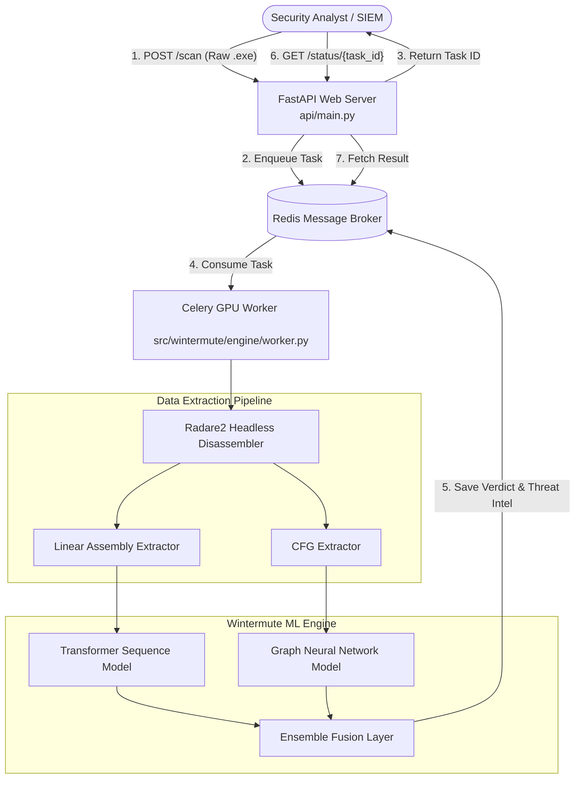

We will focus on the most critical upgrade: The Asynchronous Headless Ingestion Pipeline. This allows the system to natively ingest raw .exe/.elf files, dynamically reverse-engineer them, and run heavy Deep Learning inference without locking up the web server.

1. The New Target Architecture
We are moving to an Event-Driven Microservices Architecture. FastAPI handles rapid client requests, Redis acts as the message broker, and GPU-enabled Celery workers handle the heavy CPU/GPU lifting in the background.


## Phase 1: Dependencies & Environment
To dynamically reverse-engineer binaries, we need Radare2 (a blazing-fast, open-source reverse engineering framework) and its Python wrapper, along with our asynchronous queueing tools.

1. Update requirements.txt:

```text
r2pipe==1.7.7
celery==5.3.6
redis==5.0.1
networkx==3.1
python-multipart==0.0.6
```

2. Update Dockerfile:
Add the installation of the Radare2 C-binaries before installing Python packages.

```dockerfile
FROM pytorch/pytorch:2.1.0-cuda11.8-cudnn8-runtime

# Install system dependencies & Radare2
RUN apt-get update && apt-get install -y wget git build-essential \
    && git clone https://github.com/radareorg/radare2 \
    && radare2/sys/install.sh \
    && rm -rf /var/lib/apt/lists/*

WORKDIR /app
COPY requirements.txt .
RUN pip install --no-cache-dir -r requirements.txt

COPY . .
# API startup command
CMD ["uvicorn", "api.main:app", "--host", "0.0.0.0", "--port", "8000"]
```

## Phase 2: The Headless Disassembly Engine
Create a new file src/wintermute/data/extractor.py. This script programmatically opens a raw binary, traces its execution paths, and formats the output into the exact tensors your models expect.

```python
import r2pipe
import json
import networkx as nx
import logging

logger = logging.getLogger(__name__)

class HeadlessDisassembler:
    """Extracts ML features directly from raw executable binaries using Radare2."""
    
    def __init__(self, binary_path: str):
        self.binary_path = binary_path
        # Open binary in quiet mode (-q), suppress stderr (-2)
        self.r2 = r2pipe.open(self.binary_path, flags=['-q', '-2'])
        
    def extract_features(self):
        logger.info(f"Analyzing {self.binary_path}...")
        # 'aaa' tells Radare2 to perform advanced analysis on all functions
        self.r2.cmd("aaa")
        
        sequence = []
        cfg = nx.DiGraph()
        
        # 'aflj': Analyze Functions List JSON
        functions = json.loads(self.r2.cmd("aflj") or "[]")
        
        for func in functions:
            # 'agj': Analyze Graph JSON (returns basic blocks and branch edges)
            func_data = json.loads(self.r2.cmd(f"agj @ {func['offset']}") or "[]")
            if not func_data:
                continue
                
            for block in func_data[0].get('blocks', []):
                block_id = block.get('offset')
                block_ops = []
                
                # 1. Extract sequential instructions for MalBERT
                for op in block.get('ops', []):
                    # We strip memory addresses/registers to prevent overfitting 
                    # E.g., 'mov eax, 0x1' -> 'mov'
                    opcode = op.get('disasm', '').split()[0] 
                    if opcode:
                        sequence.append(opcode)
                        block_ops.append(opcode)
                
                # 2. Build the CFG for the GNN
                cfg.add_node(block_id, features=block_ops, size=block.get('size', 0))
                
                # Add branching edges
                if 'jump' in block: # True branch
                    cfg.add_edge(block_id, block['jump'], type='jump')
                if 'fail' in block: # False branch
                    cfg.add_edge(block_id, block['fail'], type='fail')
                    
        self.r2.quit()
        return " ".join(sequence), cfg
```

## Phase 3: The Asynchronous Celery Worker
Create a new file src/wintermute/engine/worker.py. This runs continuously in the background. It loads your heavy ML models into memory once and processes files as they arrive in the Redis queue.

```python
import os
from celery import Celery
from src.wintermute.data.extractor import HeadlessDisassembler

# Import your existing Wintermute models here
# from src.wintermute.models.transformer import MalBERT
# from src.wintermute.models.gnn import MalwareGNN

REDIS_URL = os.getenv("REDIS_URL", "redis://localhost:6379/0")
celery_app = Celery("wintermute_worker", broker=REDIS_URL, backend=REDIS_URL)

# Pre-load Models into GPU memory once when the worker boots
# malbert = MalBERT.load_from_checkpoint("configs/model_config.yaml")
# gnn = MalwareGNN.load_from_checkpoint("configs/model_config.yaml")

@celery_app.task(bind=True, name="analyze_binary")
def analyze_binary_task(self, file_path: str):
    try:
        self.update_state(state='DISASSEMBLING', meta={'step': 'Extracting features...'})
        
        # 1. Reverse Engineering
        extractor = HeadlessDisassembler(file_path)
        sequence, cfg = extractor.extract_features()
        
        self.update_state(state='INFERENCE', meta={'step': 'Running Deep Learning models...'})
        
        # 2. Run Inference
        # seq_score = malbert.predict(sequence)
        # graph_score = gnn.predict(cfg)
        seq_score, graph_score = 0.95, 0.88 # Mock scores
        
        # 3. Ensemble Fusion Logic
        final_score = (seq_score * 0.6) + (graph_score * 0.4)
        is_malicious = final_score > 0.85
        
        # 4. Cleanup raw malware payload from disk securely
        if os.path.exists(file_path):
            os.remove(file_path)
        
        return {
            "status": "COMPLETED",
            "threat_score": round(final_score, 4),
            "is_malicious": is_malicious,
            "predicted_family": "AgentTesla" if is_malicious else "Clean",
            "telemetry": {
                "instructions_analyzed": len(sequence.split()),
                "cfg_nodes": len(cfg.nodes)
            }
        }
    except Exception as e:
        if os.path.exists(file_path):
            os.remove(file_path)
        return {"status": "FAILED", "error": str(e)}
```

## Phase 4: Refactoring the REST API
Update api/main.py so the API acts purely as a fast traffic cop—saving the file to a temporary directory and handing the job ID back to the client in milliseconds.

```python
import os
import shutil
import uuid
from fastapi import FastAPI, UploadFile, File, HTTPException
from fastapi.responses import JSONResponse
from celery.result import AsyncResult
from src.wintermute.engine.worker import analyze_binary_task

app = FastAPI(title="Wintermute Threat Intelligence API")

UPLOAD_DIR = "/tmp/wintermute_uploads"
os.makedirs(UPLOAD_DIR, exist_ok=True)

@app.post("/api/v1/scan")
async def analyze_file(file: UploadFile = File(...)):
    """Upload a raw executable and queue it for AI analysis."""
    job_id = str(uuid.uuid4())
    safe_filepath = os.path.join(UPLOAD_DIR, f"{job_id}_{file.filename}")
    
    # Save file to disk
    with open(safe_filepath, "wb") as buffer:
        shutil.copyfileobj(file.file, buffer)
        
    # Dispatch to Celery background worker
    task = analyze_binary_task.apply_async(args=[safe_filepath], task_id=job_id)
    
    return JSONResponse(status_code=202, content={
        "message": "File queued for analysis", 
        "job_id": task.id
    })

@app.get("/api/v1/status/{job_id}")
async def get_status(job_id: str):
    """Poll the status of an analysis task."""
    task_result = AsyncResult(job_id)
    
    if task_result.state == 'PENDING':
        return {"job_id": job_id, "status": "PENDING_IN_QUEUE"}
    elif task_result.state in ['DISASSEMBLING', 'INFERENCE']:
        return {"job_id": job_id, "status": task_result.state, "details": task_result.info}
    elif task_result.state == 'SUCCESS':
        return {"job_id": job_id, "result": task_result.result}
    elif task_result.state == 'FAILURE':
        return {"job_id": job_id, "status": "FAILED", "error": str(task_result.info)}
    else:
        raise HTTPException(status_code=404, detail="Job not found")
```

## Phase 5: Production Docker Orchestration
Create a docker-compose.yml file in the root directory to spin up the API, the Redis broker, and the Celery workers simultaneously.

```yaml
version: '3.8'

services:
  redis:
    image: redis:7-alpine
    ports:
      - "6379:6379"

  api:
    build: .
    command: uvicorn api.main:app --host 0.0.0.0 --port 8000
    volumes:
      - ./tmp_uploads:/tmp/wintermute_uploads
    ports:
      - "8000:8000"
    environment:
      - REDIS_URL=redis://redis:6379/0
    depends_on:
      - redis

  worker:
    build: .
    command: celery -A src.wintermute.engine.worker.celery_app worker --loglevel=info -c 4
    volumes:
      - ./tmp_uploads:/tmp/wintermute_uploads
    environment:
      - REDIS_URL=redis://redis:6379/0
    depends_on:
      - redis
    # Uncomment to enable GPU passthrough for faster PyTorch inference
    # deploy:
    #   resources:
    #     reservations:
    #       devices:
    #         - driver: nvidia
    #           count: 1
    #           capabilities: [gpu]
```

## Testing the Real-World Scenario
Spin up the SOC infrastructure:

```bash
docker-compose up --build -d
```

Submit a raw executable (Simulating an EDR agent sending a zero-day):

```bash
curl -X POST -F "file=@suspicious_payload.exe" http://localhost:8000/api/v1/scan
```

Response: `{"message": "File queued for analysis", "job_id": "a1b2c3d4-..."}`

Poll for the AI verdict 10 seconds later:

```bash
curl http://localhost:8000/api/v1/status/a1b2c3d4-...
```

## Next Steps for Explainable AI (XAI)
To complete Phase 2 (Explainable AI) from the previous strategic plan, you can map the Transformer Attention Weights back to the Radare2 offsets. Because the extractor.py sequentially parses the basic blocks, you can maintain a dictionary mapping instruction_index -> block_offset. When MalBERT flags a specific sequence of instructions as malicious (via high self-attention scores), your API can return the exact Hex Offsets to the analyst, showing them exactly where in the binary the malicious behavior lives.