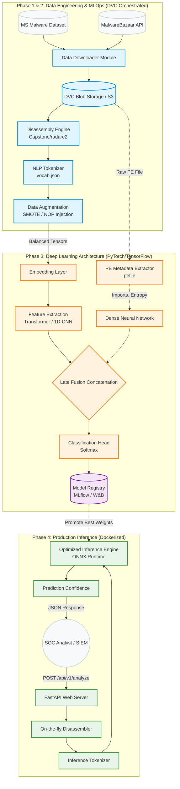

# Technical Specification: Project Wintermute
**Version:** 2.0 (Enterprise Refactor & MLOps Integration)  
**Domain:** Deep Learning, NLP, Static Malware Analysis  
**Objective:** Transition Wintermute from a sequential scripting prototype into a modular, production-ready, and highly scalable MLOps malware classification engine.

---

## 1. Executive Summary
Project Wintermute is an AI-powered static malware analysis framework. By treating disassembled executables (`.asm`) as a Natural Language Processing (NLP) problem, Wintermute maps execution flow to integer tokens, passing them through a Deep Learning sequence model to classify malware families (e.g., *AgentTesla*, *Trickbot*) and detect zero-day variants without relying on easily bypassed traditional file hashes.

This specification outlines a 4-phase architectural overhaul to implement modern software engineering principles, MLOps tracking, advanced AI feature engineering, and a production API deployment pipeline. *(Note: Agentic/Cognitive LLM frameworks are out-of-scope for this specification and are reserved for a future Phase 5).*

---

## 2. System Architecture Diagram

The following diagram illustrates the complete end-to-end pipeline of the production-ready Wintermute system, from data ingestion to model deployment.



---

## 3. Phase 1: Architectural Refactoring (Software Engineering)
**Goal:** Eliminate tightly coupled, sequentially numbered scripts (`01_`, `02_`) in favor of a modular, object-oriented Python package with strict dependency management.

### 3.1 Target Directory Structure
The repository will be restructured to separate configuration, raw data, source code, and deployment assets.

```text
wintermute/
├── configs/                    # Centralized configurations (YAML)
│   ├── data_config.yaml        # Vocab sizes, sequence lengths, paths
│   └── model_config.yaml       # Learning rate, batch size, layers, dropout
├── data/                       # Ignored by Git, managed by DVC
│   ├── raw/                    # Raw Bazaar and MS-Malware files (.exe / .asm)
│   ├── processed/              # Tokenized tensors, vocab.json, families.json
│   └── synthetic/              # Output from SMOTE/Heuristic generation
├── src/wintermute/             # Main Python Package (Namespaced)
│   ├── __init__.py
│   ├── data/                   # Data ingestion & tokenization pipelines
│   │   ├── downloader.py       # (Replaces 04_, 05_ scripts)
│   │   ├── tokenizer.py        # (Replaces 01_, 06_ scripts)
│   │   └── augment.py          # (Replaces generate_synthetic_data.py)
│   ├── models/                 # Neural network architecture definitions
│   │   ├── sequence.py         # 1D-CNN / LSTM (Replaces 02_model.py)
│   │   └── transformer.py      # New Self-Attention architectures
│   ├── engine/                 # Training & Evaluation logic
│   │   ├── trainer.py          # (Replaces 03_train.py)
│   │   └── metrics.py          # F1-scores, Confusion Matrix calculations
│   └── cli.py                  # Centralized command-line interface
├── api/                        # FastAPI web server wrappers
│   ├── main.py                 # REST API endpoints
│   └── schemas.py              # Pydantic request/response data models
├── tests/                      # Pytest unit and integration tests
├── Dockerfile                  # Containerization for deployment
├── pyproject.toml              # Modern dependency management
└── dvc.yaml                    # Data pipeline orchestration (DAG)
```

### 3.2 Core Software Upgrades

  * **Dependency Management:** Migrate from `requirements.txt` to `pyproject.toml` using **uv** or **Poetry** for deterministic dependency resolution and lock-files.
  * **CLI Orchestration:** Merge `scan.py` and `scan_family.py` into a single, unified CLI using **Typer** or **Click** (e.g., `wintermute scan file.exe` or `wintermute train --config configs/model_config.yaml`).
  * **Configuration Management:** Implement **Hydra** or **OmegaConf** to load `.yaml` parameters dynamically, removing all hardcoded hyperparameter variables and file paths from the Python source code.

---

## 4. Phase 2: MLOps Implementation

**Goal:** Introduce tracking and reproducibility to handle massive malware datasets, prevent concept drift, and orchestrate training pipelines.

### 4.1 Data Version Control (DVC)

  * **Mechanism:** Track massive `.asm` and `.exe` files using **DVC**. Raw malware and processed tensors will be stored in a remote blob storage bucket (e.g., AWS S3, Google Cloud Storage, or a local NAS). Git will only track lightweight `.dvc` pointer files.
  * **Benefit:** Developers can pull the exact dataset tied to a specific Git commit without bloating the repository size.

### 4.2 Pipeline Orchestration (DAGs)

  * **Mechanism:** Define a Directed Acyclic Graph (DAG) in `dvc.yaml` mapping the exact data flow: `Download -> Tokenize -> Augment -> Train -> Evaluate`.
  * **Benefit:** Running `dvc repro` will automatically detect which files have changed and re-run only the necessary steps, caching unchanged stages to save hours of compute time.

### 4.3 Experiment Tracking

  * **Mechanism:** Integrate **Weights & Biases (W&B)** or **MLflow** into `src/wintermute/engine/trainer.py`.
  * **Metrics Tracked:** Epoch loss, Validation Accuracy, Macro F1-Score per malware family, hardware utilization (GPU VRAM), and hyperparameters.
  * **Benefit:** Enables visual comparison of different AI architectures and easy model registry rollbacks to the best-performing weights.

---

## 5. Phase 3: AI & Feature Engineering Enhancements

**Goal:** Harden the neural network against modern obfuscation techniques (e.g., NOP sleds, code reordering, packing) used by advanced threat actors.

### 5.1 Architecture Upgrades

  * **Transformer Architecture (MalBERT):** Implement a Transformer-based sequence model to replace standard 1D-CNNs/LSTMs. The Self-Attention mechanism will allow Wintermute to mathematically connect malicious intent across thousands of lines of assembly, ignoring injected "junk" code.
  * **Control Flow Graphs (CFG):** Utilize Graph Neural Networks (GNNs) to analyze the logical execution flow rather than top-to-bottom text. Use a tool like `angr` to extract the graph. Nodes represent code blocks; edges represent jumps/branches.

### 5.2 Multi-Modal Feature Fusion (Late Fusion)

  * **Mechanism:** Expand the input features beyond raw opcodes. Extract Portable Executable (PE) metadata using the `pefile` library (e.g., Imported DLLs, Section Entropy, API calls, Compiler Stamps).
  * **Fusion:** Pass PE metadata through a Dense Neural Network, pass Assembly via the NLP network, and concatenate the output tensors prior to the final Softmax classification layer for a highly accurate hybrid model.

### 5.3 Synthetic Data & Class Imbalance

  * **Mechanism:** Enhance `augment.py` to utilize **SMOTE** (Synthetic Minority Over-sampling Technique) in the embedding space to synthesize rare malware families (e.g., APT ransomware), preventing model bias toward high-volume commodity malware (e.g., Adware).
  * **Heuristics:** Implement heuristic augmentation (e.g., swapping unused registers, injecting dead code) to force the model to learn malicious behavior rather than file layout.

---

## 6. Phase 4: Production Inference Pipeline (Deployment)

**Goal:** Decouple Wintermute from manual Python scripts and deploy it as a scalable, accessible cybersecurity tool for SOC (Security Operations Center) analysts.

### 6.1 Automated Disassembly Engine

  * **Mechanism:** Integrate **Capstone**, **LIEF**, or **radare2** directly into the inference pipeline (`src/wintermute/data/tokenizer.py`).
  * **Benefit:** Users no longer need to manually reverse-engineer files into `.asm`. They can input a raw `.exe` or `.dll`, and Wintermute will automatically unpack, disassemble, and tokenize it in memory on the fly.

### 6.2 REST API Server

  * **Mechanism:** Build a high-performance, asynchronous API using **FastAPI** (`api/main.py`).
  * **Endpoint Specifications:**
      * `POST /api/v1/analyze`: Accepts a multipart form-data binary file upload.
      * **Response Payload (JSON):**
        ```json
        {
          "id": "req-987abc",
          "filename": "suspicious_invoice.exe",
          "sha256": "8d4f...b1c9",
          "status": "MALICIOUS",
          "confidence_score": 0.985,
          "predicted_family": "AgentTesla",
          "model_version": "v2.1.0-transformer",
          "execution_time_ms": 142
        }
        ```

### 6.3 Containerization

  * **Mechanism:** Package the FastAPI server, disassembly OS-level dependencies, and optimized model weights (ONNX/TorchScript) into a lightweight **Docker** container. Use Gunicorn with Uvicorn workers to serve the app.
  * **Benefit:** Enables instant, zero-configuration deployment to air-gapped security servers, Kubernetes clusters, or local SOC environments.